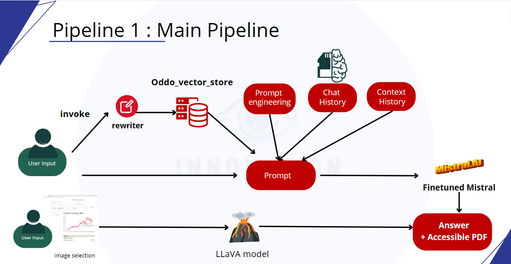
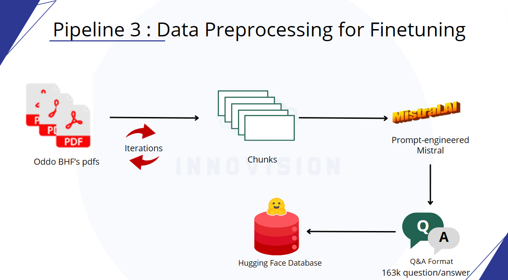

# Solution overview:
Create a financial advisor chatbot for Oddo BHF's clients by providing the required functionalities, integrating the CSR strategy, while guaranteeing the scalability and reliability of this chatbot.
Data is highly confidential and is put  private and not accessible.

## What do you find in this project ?
1) Used Technologies:
   
   Langchain as a Workflow Framework, for the general pipeline and RAFT (RAG+RAFT) purposes.

   Mistral 7B as an LLM.

   Azure for computational ressources and work environment.
   
   Huggingface for storing private data.
   
   Gradio for Deployment.
   
3) Data:
   
   2665 pdfs were ingested plus it’s Metadata.
   
4) Functionalities:
   
   Chat history and context history feature.
   
   Snippet provision.
   
   Image extraction feature.
   
5) Pipelines:
   
   General architecture:
   
   
   
   Main Pipeline:
   

   Data ingestion Pipeline:
   

   Data Preprocessing for Finetuning Pipeline:
   

   Finetuning Pipeline:
   

## Credits

 Credits for ODDO-BHF for the data.
 
 Credits for the project structure and implementation goes to INNOVISION
 
 INNOVISION Team Members: 
 - Med Karim Akkari
 - Karim Aloulou
 - Yosr Abbassi
 - Nadia Bedhiafi
 - Med Hedi Souissi
 - Med Dhia Mediouni
 - Sarra Gharsallah

